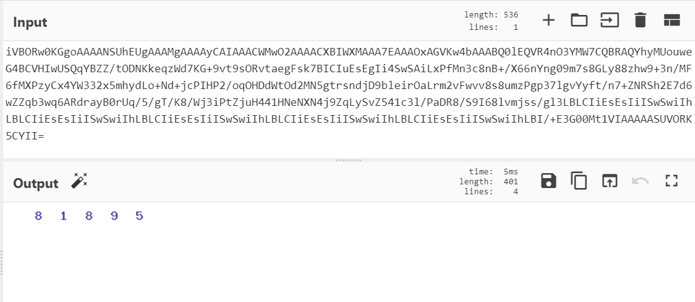

## Break Me

### Deskripsi

belakangan ini banyak banget yang buat game berbasis console mode, ini ada game tebak-tebakan bukan game ML lho ya, hanya game yang menguji mata :D

```
nc 103.147.32.214 9002
```


### Solusi

setelah mencoba didapatkan sebuah service yang mengharuskan menjawab sebanyak 150 pertanyaan dengan benar, sekali salah score akan kembali menjadi 0.

```
iVBORw0KGgoAAAANSUhEUgAAAMgAAAAyCAIAAACWMwO2AAAACXBIWXMAAA7EAAAOxAGVKw4bAAABQ0lEQVR4nO3YMW7CQBRAQYhyMUouweG4BCVHIwUSQqYBZZ/tODNKkeqzWd7KG+9vt9sORvtaegFsk7BICIuEsEgIi4SwSAiLxPfMn3c8nB+/X66nYng09m7s8GLy88zhw9+3n/MF6fMXPzyCx4YW332x5mhydLo+Nd+jcPIHP2/oqOHDdWtOd2MN5gtrsndjD9bleirOaLrm2vFwvv8s8umzPgp37lgvYyft/n7+ZNRSh2E7d6wZZqb3wq6ARdrayB0rUq/5/gT/K8/Wj3iPtZjuH441HNeNXN4j9ZqLySvZ541c3l/PaDR8/S9I68lvmjss/gl3LBLCIiEsEsIiISwSwiIhLBLCIiEsEsIiISwSwiIhLBLCIiEsEsIiISwSwiIhLBLCIiEsEsIiISwSwiIhLBLCIiEsEsIiISwSwiIhLBI/+E3G00Mt1VIAAAAASUVORK5CYII=
```

ternyata setelah di-decode hasilnya adalah gambar captcha



jadi yang harus dilakukan adalah mendecode base64 menjadi image kemudian membaca isi-image dan mengirimkanya kembali sebagai jawaban. untuk bisa membaca image dibutuhkan Tesseract Executable dan libnya untuk python

```
sudo apt install tesseract-ocr -y
python2 -m pip install pytesseract
```

```
from pwn import *
import pytesseract
import base64

p = remote('103.147.32.214', 9002)
p.recvuntil(b' >')
p.sendline(b'Yes')
p.recvline(3)

run = True

def decode(img_str):
    imgdata = base64.b64decode(img_str)
    filename = '_image.png'
    with open(filename, 'wb') as f:
        f.write(imgdata)
    text = pytesseract.image_to_string(filename)
    text = text.replace("\x0c","")
    text = ''.join(c for c in text if c.isdigit())
    p.info(text)
    return text

def send(text):
    p.sendline(text.encode())
    p.recvline()
    res = p.recv(4200)[:-40]
    if 'Congrats You right'.encode() in res:
        b64 = res[71:]
        next = decode(b64)
        send(next)
    elif 'lasctf{'.encode() in res:
        print(res)
        p.close()

b64_image = p.recv(4200)[9:-40]
text = decode(b64_image)
send(text)
p.close()
```

setelah dijalankan beberapa kali, karena sifatnya OCR tidak selalu berhasil

```
$ python3 exp.py
[+] Opening connection to 103.147.32.214 on port 9002: Done
[*] 63038
[*] 25503
[*] 30330
[*] 77398
[*] 78200
[*] 64043
[*] 86632
[*] 40762
[*] 28049
[*] 42647
[*] 18433
[*] 43081
[*] 78782
[*] 47500
[*] 15566
...
...
Congrats Made it, as a promise, here is your flag...\r\n
lastctf{th15_15_h0w_p30pl3_b34t_th3_c4ptch4_0ut_th3r3}
```