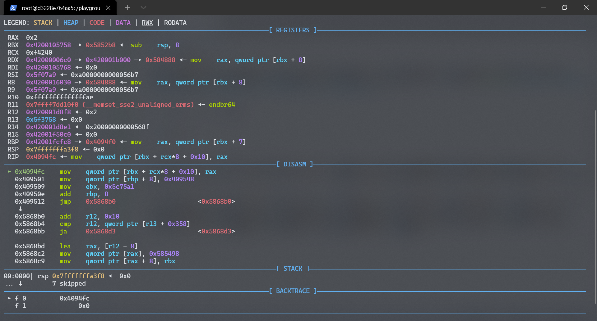
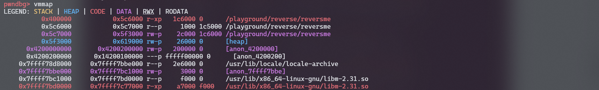
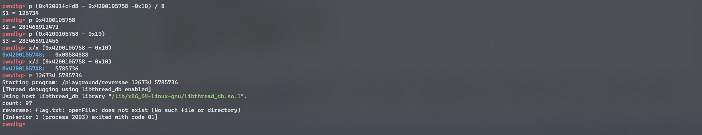
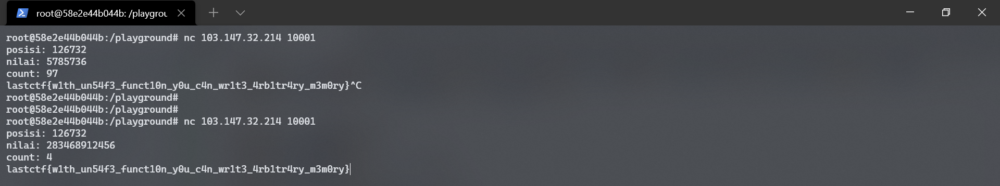

## Immutable Array

### Deskripsi

tidak peduli bahasa pemrograman apa yang anda gunakan, Anda diharuskan untuk dapat menerapkan beberapa logika pemrograman, seperti memanipulasi variable array yang bersifat immutable [Download](https://mega.nz/file/TyBhjQCI#y7Wjd7EkNIykO0HjsvJgVtU5XK_RRcmDBA_nWT-qhgI)

```
nc 103.147.32.214 10001
```

### Solusi


```
reversme: ELF 64-bit LSB executable, x86-64, version 1 (SYSV), dynamically linked, interpreter /lib64/ld-linux-x86-64.so.2, for GNU/Linux 3.2.0, BuildID[sha1]=11e898880b49e9815a71cf94487e943cbf95811c, stripped
```

Diberikan 1 buah striped ELF dengan 1 argumen masukan INDEX dan VALUE dan hanya menerima angka, jika input bukan berupa angka pesan `cannot parse value` akan muncul, berdasarkan judul dan informasi dari masukan berupa INDEX dan VALUE diasumsikan INDEX adalah posisi array dan value adalah value dari index array tersebut. jika dijalankan dengan gdb dan mencoba memberikan inputan index yang besar `1000000` aplikasi crash karen kecil kemungkinan terdapat array dengan index `1000000` 



terlihat aplikasi mengalami crash karena mencoba memberikan/mengakses nilai dari sebuah kemungkinan pointer yang beralamat di rbx atau `0x4200105758` dan dengan index pada rcx dengan nilai `0xf4240` atau sama dengan `1000000` berdasar pada `qword ptr [rbx + rcx*8 + 0x10], rax` alamat pointer dalam meyimpan data adalah `rbx + 0x10` dan `rbp + 0x10` merupakan lokasi pointer tersebut. ini dipastikan dengan beberapa kali percobaan dengan nilai input yang berbeda-beda nilai dari `rbp` dan `rbx` tidak berubah. jika diperhatikan pada vmmap pointer 



alamat `0x4200105758` berada dalam rentang stack `0x4200000000 - 0x4200200000` kemungkinan `0x4200105758` adalah alamat sebuah pointer menjadi semakin besar. jika dicoba search pada gdb 

```
search -8 0x4200105758
pwndbg> search -8 0x4200105758
[anon_4200000]  0x42001fcfd8 0x4200105758
pwndbg>
```

alamat base address pointer ada pada alamat `0x42001fcfd8`, jadi untuk mencari index yang valid dapat menggunakan rumus `(0x42001fcfd8 - 0x4200105758 -0x10) / 8` sehingga nilai index yang valid adalah `126734` sedangkan value nya sendiri adalah nilai dari alamat `0x4200105758`

```
pwndbg> p (0x42001fcfd8 - 0x4200105758 -0x10) / 8
$1 = 126734
```

karena array nya bersifat immutable atau tidak bisa dirubah, tidak perlu merubah array, cukup mencari value yang bisa ditampung oleh index `126734` tidak perduli berapa nilainya karena tidak ada fungsi untuk memeriksa isi dari arraynya selama array bernilai valid maka instruksi akan tetap dijalankan untuk itu cukup mencari value dari `0x4200105758` dikurangi `0x10`

```
pwndbg> p 0x4200105758
$1 = 283468912472
pwndbg> p (0x4200105758 - 0x10)
$2 = 283468912456
pwndbg> x/x (0x4200105758 - 0x10)
0x4200105748:   0x00584888
pwndbg> x/d (0x4200105758 - 0x10)
0x4200105748:   5785736
pwndbg>

```

jika dijalankan ulang dengan inputan 126734 sebagai index/posisi dan `283468912456` atau `5785736` sebagai value maka hasilnya adalah :




setelah mencoba diremote, payload tersebut tidak jalan menggunakan index/posisi `126734`, tetapi berjalan dengan nilai inded `126732` sepertinya alamat rbp diremote dan dilocal berbeda mungkin dikarenakn ASLR yang aktif, biasanya jika ASLR aktif offset perbedaan alamat tidak terlalu jauh biasanya hanya berbeda beberapa bit saja, jadi menaikan dan menurunkan nilai index (rbp) bisa menjadi opsi jika tidak ingin melakukan bruteforcing. perbedaan alamat nya

```
0x42001fcfd6 di remote service = 126732
0x42001fcfd8 di local = 126734
```



