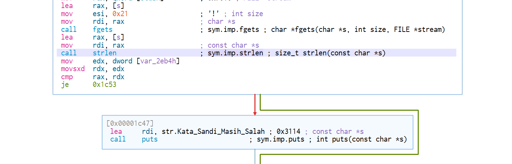
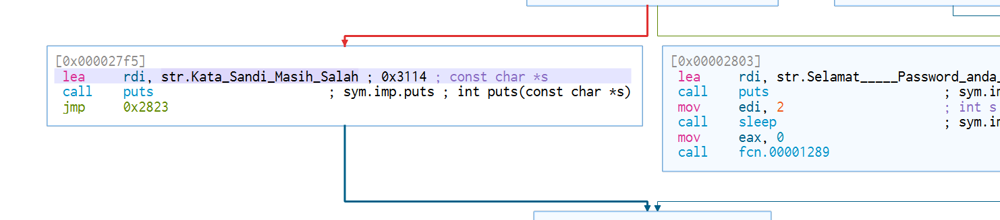

## Safebox Donat

### Deskripsi

Agen FBI menemukan sebuah aplikasi yang menurut informasi Intel terdapat beberapa nama tersangka pencurian Donat, menurut informasi pemilik Donat, Donat mereka menghilang dari barisan.[Download](https://mega.nz/file/jvwCwKRY#EO-BzCfayoBdoXrISCP74-GuyX0Adq77c_znRRsipEc)

### Solusi

```
dounat: ELF 64-bit LSB shared object, x86-64, version 1 (SYSV), dynamically linked, interpreter /lib64/ld-linux-x86-64.so.2, BuildID[sha1]=07dd6bf1924022180672571763672a34c66faa24, for GNU/Linux 3.2.0, stripped
```

Diberikan sebuah Striped ELF file yang jika di-jalankan menerima inputan `Masukan Kata Sandi Anda` dengan output `Kata Sandi Masih Salah` apapun jenis inputanya, dengan menggunakan tools [cutter](https://cutter.re/) bisa dilihat graph dan disassamblenya. berikut potongan bagian yang memeriksa panjang inputan yang dimasukan.



terlihat jika pemeriksaan panjang `strlen` antara `rdi` dan `rax` jika panjang tidak sama maka intruksi dilanjutkan ke `0x00001c47` untuk menampilkan pesan kesalahan, dan kemudian instruksi tetap dilanjutkan tanpa ada `exit` menuju `0x000027f5` untuk menampilkan pesan kesalahan berikutnya.




jika di-decompiler, kira-kira bentuk psedeo-code nya seperti berikut

```c
puts("Katanya Safebox Paling Secure Di Jagat Pernganuan");
printf("Masukan Kata Sandi Anda: ");
fgets(&s, 0x21, _stdin);
iVar1 = strlen(&s);
if (iVar1 != 0x20) {
    puts("Kata Sandi Masih Salah");
}
...
...
...
...
if ((uint32_t)var_2f3ch == 0x20) {
    puts("Selamat!!!! Password anda sudah benar, Harap Tunggu");
    sleep(2);
    fcn.00001289();
} else {
    puts("Kata Sandi Masih Salah");
}
```

informasi yang bisa didapat yaitu panjang inputan harus `0x20` atau sama dengan `32` karakter, kemudian jika 
sesuatu pada `eax` panjang nya juga harus `0x20`

jika diperhatikan variable `var_2f3ch` bersumber dari 

```c
if (!bVar6) {
    var_2f3ch._0_4_ = (uint32_t)var_2f3ch + 1;
}
```

dimana `bVar6` akan berinilai `true` atau `false` dari hasil perulangan yang terjadi pada

```c
for (var_2eb8h = 0; var_2eb8h < 0x5c; var_2eb8h = var_2eb8h + 1) {
    if ((int32_t)var_11h == *(int32_t *)((int64_t)&c + (int64_t)(int32_t)var_2eb8h * 4)) {
        bVar6 = true;
    }
}
```

nilai `bVar6` akan ditambahkan dengan `1` jika hasil perulangan bernilai `false`, bisa diperhatikan pada hasil comparasi  `(int32_t)var_11h == *(int32_t *)((int64_t)&c + (int64_t)(int32_t)var_2eb8h * 4)` , bagian code ini memeriksa apakah nilai `var_11h` sama dengan nilai variable `var_2eb8h` dalam array, jika di ikuti variable `var_2eb8h` bersumber dari 

```c
piVar2 = (int64_t *)L"!\"#$%&\'()*+,-./0123456789:;<=>?@ABCDEFGHIJKLMNOPQRSTUVWXYZ[\\]^_`abdefghijklmnopqrstuvwxyz{|";
piVar4 = &c;
for (iVar1 = 0x2e; iVar1 != 0; iVar1 = iVar1 + -1) {
    *piVar4 = *piVar2;
    piVar2 = piVar2 + 1;
    piVar4 = piVar4 + 1;
}
```

jadi kira-kira `var_11h==c[var_2eb8h]` akan bernilai `bVar6=true` sedangkan `var_2f3ch._0_4_+1` jika `bVar6=true` dan jika dilihat `piVar2` adalah deretan `ascii` deretan printable `ascii` dimulai dari `0x33 = !` sama seperti varibale `piVar2` yang kemudian menjadi nilai dari variable `piVar4` atau array dari variable `&c` maka dapat disimpulkan bahwa perulangan tersebut akan bernilai `false` ketika salah satu karakter `ascii` dari inputan tidak ada dalam deretan `&c` dengan begitu `bVar6=false` dan `var_2f3ch._0_4_+1` intinya mencari karakter `ascii` yang hilang, berbekal informasi tersebut bisa didapatkan flagnya dengan mencari 1 karakter `ascii` yang hilang dari masing-masing variable `var_2f34h` sampai dengan variable `var_2eb8h` yang berjumlah `32` array, misalnya seperti

```c
piVar2 = (int64_t *)L"!\"#$%&\'()*+,-./0123456789:;<=>?@ABCDEFGHIJKLMNOPQRSTUVWXYZ[\\]^_`abcdefghijkmnopqrstuvwxyz{|}";
piVar2 = (int64_t *)L"!\"#$%&\'()*+,-./0123456789:;<=>?@ABCDEFGHIJKLMNOPQRSTUVWXYZ[\\]^_`bcdefghijklmnopqrstuvwxyz{|}";
piVar2 = (int64_t *)L"!\"#$%&\'()*+,-./0123456789:;<=>?@ABCDEFGHIJKLMNOPQRSTUVWXYZ[\\]^_`abcdefghijklmnopqrtuvwxyz{|}";
```

dari ketiga contoh variable diatas bisa dilihat jika karakter `l,a,s` tidak ada dalam deretan, jika di cari semua didapatkan flagnya

```
lastctf{f1nd_th3_mi55in9_numb3r}
```