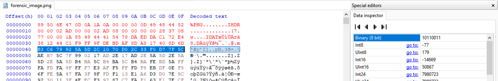

## Unknow Format

### Deskripsi

Kak ini foto mantan ku, tapi kok ga bisa dibuka ya kak ?
hint : Perbaiki kepala & crc 32 calculation
[Download](https://mega.nz/file/y7J0CTSJ#s4C4wIQqw0KX9ZlypTktbRZxcboiW6X2pLFqwKQ7Ca0)

### Solusi

```
file forensic_image.png
forensic_image.png: data
```

terlihat jika file gambarnya dideteksi sebagai data bukanya image.

```
hexdump -C -n 80 forensic_image.png
00000000  89 50 4e 47 0d 0a 1b 1c  00 00 00 0d 49 48 44 52  |.PNG........IHDR|
00000010  00 00 01 a9 00 00 01 a9  08 00 00 00 00 12 61 99  |..............a.|
00000020  87 00 00 0a 49 49 44 41  54 78 da ed da d1 8e e3  |....IIDATx......|
00000030  46 0c 05 51 bb dd ff 27  8f 41 16 63 a9 8a ad 6c  |F..Q...'.A.c...l|
00000040  4c 6f e9 69 66 c7 96 ba  fb 68 81 0b 92 af bf ba  |Lo.if....h......|
```

berdasarkan [https://www.w3.org/TR/PNG-Rationale.html#R.PNG-file-signature](https://www.w3.org/TR/PNG-Rationale.html#R.PNG-file-signature) dan [http://www.libpng.org/pub/png/spec/1.2/PNG-Contents.html](http://www.libpng.org/pub/png/spec/1.2/PNG-Contents.html) terlihat dibeberapa bagian tidak valid, untuk itu bisa menggunakan tools pngcheck untuk melihat detailnya.

```
pngcheck -7cfpqtv forensic_image.png
File: forensic_image.png (6846 bytes)
  File is CORRUPTED.  It seems to have suffered EOL conversion.
ERRORS DETECTED in forensic_image.png
```

pertama perbaiki dulu header, idat, chunk dan crc nya, bisa menggunakan tools [https://github.com/sherlly/PCRT](https://github.com/sherlly/PCRT)

```
python2 PCRT/PCRT.py -v -i forensic_image.png -o output.png

[Detected] Wrong PNG header!
File header: 89504E470D0A1B1C
Correct header: 89504E470D0A1A0A

[Detected] Error IHDR CRC found! (offset: 0x1D)
chunk crc: 12619987
correct crc: 12479687

[Detected] Error IDAT chunk data length! (offset: 0x21)
chunk length:A49
actual length:1A85

```

setelah diperbaiki menggunakan PCRT, hasilnya

```
pngcheck -7cfpqtv output.png

File: output.png (6846 bytes)
  chunk IHDR at offset 0x0000c, length 13
    425 x 425 image, 8-bit grayscale, non-interlaced
  CRC error in chunk IHDR (computed 12479687, expected 12619987)
  chunk IDAT at offset 0x00025, length 2633
    zlib: deflated, 32K window, maximum compression
  CRC error in chunk IDAT (computed 4b55db9a, expected 89d669a9)
  invalid chunk name "u" (17 ffffffc0 75 ffffffb2)
  chunk u at offset 0x00a7a, length 266587471:  EOF while reading data
ERRORS DETECTED in output.png
```

dengan menggunakan tools tersbebut kita bisa tau bagian mana yang harus diperbaiki, dan hasil akhirnya juga belum tentu bisa menyelesaikan masalah, jadi membaca http://www.libpng.org/pub/png/spec/1.2/PNG-Contents.html adalah cara terbaik. berdasarkan dokumen tersebut hal yang paling penting adalah mencari tau dimensi dari file image itu sendiri, karena IDAT CHUNK dan CRC signaturenya akan berpengaruh jika nilai tersebut tidak sesuai, 

```
0000000D  // byte length of IHDR chunk contents, 4 bytes, value 13
49484452  // IHDR start - 4 bytes
00000004  // Width                        4 bytes }
00000001  // Height                       4 bytes }
```

dalam kasus ini bernilai `00 00 01 a9` untuk width dan bernilai `00 00 01 a9` dan `0x000001a9` = `425` dalam decimal, saya mencoba menaikan angkat tersebut per 5 byte sehingga tools `PCRT.py` bisa memperbaiki keseluruhan yang tidak valid, dengan merubah `0x000001a9 + 0x5 = 0x000001ae` dan seterusnya hingga bernilai `0x000002ad` karena pada file yang rusak width=height jadi bagian `00 00 01 a9` diganti menjadi `00 00 02 ad` sehingga jika di cek dengan pngcheck

```bash
$ pngcheck -7cfpqstvx output.png
Scanning: output.png
output-1.png: contains output.png PNG 1
File: output-1
  chunk IHDR at offset 0x0000c, length 13
    685 x 685 image, 8-bit grayscale, non-interlaced
  CRC error in chunk IHDR (computed 28370877, expected 12619987)
  chunk IDAT at offset 0x00025, length 2633
    zlib: deflated, 32K window, maximum compression
  CRC error in chunk IDAT (computed 4b55db9a, expected 89d669a9)
  invalid chunk name "u" (17 ffffffc0 75 ffffffb2)
  chunk u at offset 0x00a7a, length 266587471:  EOF while reading data
```

atau jika dengan `PCRT.py`

```bash
$ python2 PCRT/PCRT.py -v -i output.png -o output-2.png
[Detected] Error IHDR CRC found! (offset: 0x1D)
chunk crc: 12619987
correct crc: 28370877
[Detected] Error IDAT chunk data length! (offset: 0x21)
chunk length:A49
actual length:1A85
```

proses ini dilakukan berulang kali hingga file benar2 bisa diperbaiki dengan tools `PCRT.py` dikombinasikan dengan `pngcheck`

```bash
$ pngcheck -7cfpqstvx output-2.png
Scanning: output-2.png
output-2-1.png: contains output-2.png PNG 1
File: output-2-1
  chunk IHDR at offset 0x0000c, length 13
    685 x 685 image, 8-bit grayscale, non-interlaced
  chunk IDAT at offset 0x00025, length 6789
    zlib: deflated, 32K window, maximum compression
  CRC error in chunk IDAT (computed 345b36bd, expected b543afc5)
  chunk IEND at offset 0x01ab6, length 0
```

hingga mendapatkan hasil seperti berikut

```bash
$ python2 PCRT/PCRT.py -v -i output-2.png -o output-3.png

[Finished] Correct PNG header
[Finished] Correct IHDR CRC (offset: 0x1D): 28370877
[Finished] IHDR chunk check complete (offset: 0x8)
[Finished] Correct IDAT chunk data length (offset: 0x21 length: 1A85)
[Detected] Error IDAT CRC found! (offset: 0x1AAE)
chunk crc: B543AFC5
correct crc: 345B36BD
[Notice] Try fixing it? (y or n) [default:y] y
[Finished] Successfully fix crc
[Finished] IDAT chunk check complete (offset: 0x21)
[Finished] Correct IEND chunk
[Finished] IEND chunk check complete
[Finished] PNG check complete
[Notice] Show the repaired image? (y or n) [default:n] n
```

tetapi hasilnya gambar kosong, dari informasi `pngcheck` terdapat informasi jika gambar adalah `8-bit grayscale, non-interlaced` yang artinya hanya ada warna hitam dan putih, jika dibaca lebih detail pada spesifikasi file png ada informasi yang mengatur bagian ini, yaitu pada offset `0x40-0x4F` atau disebut juga dengan color correction, 



dengan memperbaiki bagian ini maka hasilnya adalah QrCode, jika sudah mendapatkan  QrCodenya hanya tinggal menggunakan kreatifitas, hasilnya seperti berikut


